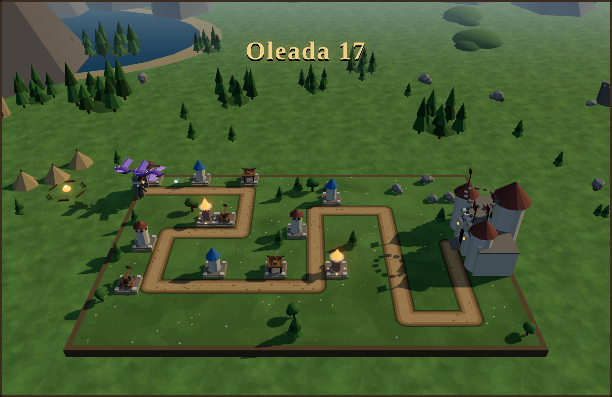

# Murallas de Rocanegra

Tower defense medieval **en 3D**, con todos los modelos hechos en **Blender** por
script, jugable en el navegador y empaquetado también como **APK de Android**.

Las hordas del Yermo avanzan por el camino hacia la fortaleza. Levanta torres a
los lados, funde el oro de las bajas en la **Forja** y aguanta **20 oleadas** (y
después, todas las que puedas en el modo infinito).



## Jugar

- **Navegador:** abre `index.html`. Sin servidor, sin instalación — los modelos
  viajan incrustados en el propio JavaScript.
- **Android:** instala `dist/rocanegra.apk` (hay que permitir orígenes
  desconocidos). Funciona sin conexión y no pide ningún permiso.

Requisitos: WebGL 2 (cualquier navegador moderno; en Android, Chrome/WebView 56+).

## Controles

| Acción | Teclado | Ratón / táctil |
| --- | --- | --- |
| Elegir torre | `1` – `5` | toca la tienda |
| Construir | — | toca una casilla libre |
| Cancelar / deseleccionar | `Esc` | clic derecho |
| Mejorar torre | `U` | botón del panel |
| Vender torre (60 % de lo invertido) | `X` | botón del panel |
| Prioridad de objetivo | `T` | botón del panel |
| Adelantar oleada (oro extra) | `Espacio` | botón *Iniciar oleada* |
| Pausa | `P` | botón *Pausa* |
| Velocidad 1× / 2× / 3× | `F` | botón de velocidad |
| Silenciar | `M` | botón 🔊 |

## Torres

| Torre | Coste | Daño | Notas |
| --- | --- | --- | --- |
| Torre de Arqueros | 70 | físico | Barata y rápida; a nivel 3 dispara dos flechas |
| Ballesta de asedio | 150 | físico | Largo alcance; el virote atraviesa hasta 4 enemigos |
| Torre de Escarcha | 120 | **mágico** | Daño en área y ralentización; ignora la armadura |
| Catapulta | 200 | físico | Gran daño en área, **no alcanza a los voladores** |
| Pira arcana | 140 | **mágico** | Llama continua que prende a los enemigos; corto alcance |

Cada torre tiene tres niveles, y cada nivel cambia también su modelo 3D.

## La Forja: mejoras pagadas con el oro de las bajas

Cada enemigo abatido suelta monedas. Ese oro tiene dos destinos: torres nuevas o
la Forja, que multiplica lo que ya tienes en el tablero.

| Mejora | Niveles | Efecto acumulativo |
| --- | --- | --- |
| Filo templado | 4 | +12 % de daño en **todas** las torres |
| Ojo de halcón | 3 | +8 % de alcance |
| Instrucción | 3 | +10 % de cadencia |
| Botín de guerra | 3 | +20 % de oro por baja |
| Reparar muralla | 5 | +3 vidas de la fortaleza |

El panel lleva la cuenta del oro fundido de las bajas, y la ficha de cada torre
muestra el bono que le aporta la Forja.

## Enemigos

Trasgos, lobos huargos, orcos, caballeros negros, ogros, guivernos, nigromantes
y dos jefes: el **Señor de la Guerra** (oleada 10) y el **Dragón de Ceniza**
(oleada 20).

- **Armadura.** Resta daño a cada impacto *físico*. Los caballeros (armadura 10)
  casi ignoran a los arqueros, pero caen ante ballestas y catapultas.
- **Magia.** Escarcha y pira hacen daño *mágico*: la armadura no lo reduce.
- **Aire.** Guivernos y dragón sobrevuelan el campo saltándose el camino. Todas
  las torres los alcanzan salvo la catapulta.
- Los nigromantes curan a sus aliados cercanos cada dos segundos.

## Compilar

```bash
npm install            # esbuild + three (solo para regenerar vendor/)
npm run models         # Blender -> assets/models/rocanegra.glb -> js/models.gen.js
npm run vendor         # empaqueta three.js + GLTFLoader + bloom en vendor/
npm run preview        # hoja de contactos de todos los modelos
npm run apk            # dist/rocanegra.apk
```

Los artefactos ya están en el repositorio: no hace falta compilar nada para
jugar.

### Modelado (Blender)

`blender/build_models.py` construye los 40 assets con primitivas y los exporta a
un único `.glb`:

```bash
blender -b -P blender/build_models.py -- --out assets/models/rocanegra.glb
```

Los nodos que el juego anima llevan sufijos convenidos: `__yaw` (parte que gira
hacia el objetivo), `__arm` (brazo de catapulta), `__body`, `__legL`/`__legR`,
`__wingL`/`__wingR`, `__blades`. El paso `optimize_meshes()` funde las mallas que
comparten padre y material: de ~450 objetos a ~230, lo que reduce mucho las
llamadas de dibujo en el móvil.

### APK sin el SDK de Google

`tools/build_apk.sh` monta el APK con las herramientas empaquetadas en Debian
(`aapt`, `zipalign`, `apksigner`, `android.jar` de `android-sdk-platform-23`) más
el dexer `dx` republicado en Maven Central. No hace falta Gradle ni el SDK de
Android:

```bash
sudo apt-get install aapt apksigner zipalign android-sdk-platform-23 default-jdk
npm run apk
```

El juego entero se copia a `assets/www` (quitando la tipografía remota), se
compila la Activity, se convierte a Dalvik, se alinea y se firma con un almacén
de depuración que el script crea la primera vez.

## Estructura

```
index.html              maquetación y orden de carga
css/style.css           interfaz (piedra, pergamino y oro)
blender/build_models.py modelado procedural de todos los assets
assets/models/          rocanegra.glb + hoja de contactos
tools/pack_models.js    empaqueta el .glb en js/models.gen.js (base64)
tools/three-entry.js    entrada que esbuild convierte en vendor/three.bundle.js
tools/build_apk.sh      construcción del APK
android/                manifiesto, Activity con WebView, icono y recursos
vendor/three.bundle.js  three.js + GLTFLoader + bloom (empaquetado)
js/utils.js             constantes, matemáticas y recorrido de polilíneas
js/audio.js             efectos de sonido sintetizados con WebAudio
js/level.js             camino, casillas bloqueadas y textura del suelo
js/enemies.js           bestiario y lógica de movimiento
js/towers.js            torres, mejoras y puntería
js/effects.js           proyectiles, partículas y rótulos
js/waves.js             guion de las 20 oleadas y modo infinito
js/perks.js             la Forja
js/render3d.js          escena 3D: paisaje, modelos, cámara y post-procesado
js/game.js              motor: economía, oleadas y bucle
js/ui.js                panel lateral, tienda, Forja y atajos
js/main.js              arranque
```

El motor no dibuja: mantiene el estado en coordenadas de tablero (píxeles) y
`js/render3d.js` lo refleja cada fotograma en la escena (x → X, y → Z, altura en
casillas). `TD.game` queda expuesto en la consola del navegador para trastear.
